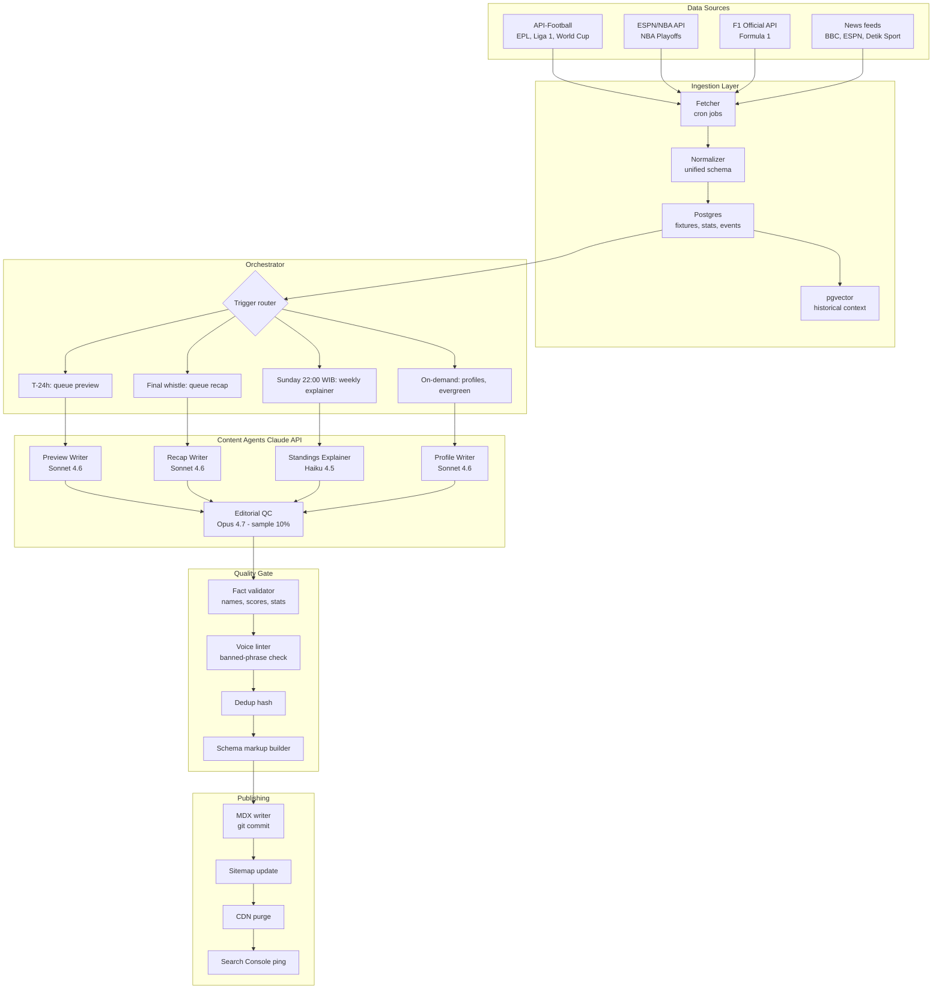

# Gibol Content Engine — Technical Spec v1.0

**Project:** SEO content + match recap/preview generation pipeline
**Site:** [www.gibol.co](https://www.gibol.co)
**Owner:** Ade
**Status:** Draft for Claude Code implementation
**Last updated:** 27 April 2026

---

## 1. Executive Overview

Gibol is a Bahasa-first multi-sport dashboard. Currently NBA Playoffs 2026 is live and four sections (F1, Premier League, FIFA World Cup, BRI Liga 1) are stubs. The strategic gap is **Bahasa-native content depth** — both as the engine for organic SEO traffic (the cheapest acquisition channel for a free sports site) and as the editorial content layer that turns dashboards into a destination.

This spec defines a single content engine that produces three classes of output:

1. **Match-driven content** — pre-match previews (24h before kick-off), post-match recaps (within 5 minutes of final whistle), and per-event recaps for F1 weekends.
2. **Standings & league content** — weekly standings explainers, race-week leaderboards, playoff bracket states.
3. **Evergreen SEO content** — team/player/driver profiles, head-to-head pages, glossary, season previews.

The system is built as a set of specialized agents — preview-writer, recap-writer, profile-writer, standings-explainer — coordinated by an orchestrator that knows what to produce when. All grounded in structured live data from sports feeds, all written in a defined Bahasa voice, all published as MDX into the Gibol repo for static-gen build.

**Build target:** Working v1 covering EPL + NBA Playoffs in 4 weeks, full coverage across all 5 sports in 8 weeks. Steady-state operating cost under $50/month at full volume.

---

## 2. System Architecture



The flow is one-way and idempotent: every published article can be regenerated from its source fixture/event without breaking. Re-runs replace, never duplicate.

---

## 3. Content Taxonomy

Each content type has a fixed shape, target word count, target keywords, and trigger.

| Type | Trigger | Words | Models | Frequency |
|---|---|---|---|---|
| **Pre-match preview** | T-24h before kickoff | 400–600 | Sonnet 4.6 | Per fixture |
| **Live match thread** _(Phase 2)_ | Kickoff | 200 + updates | Sonnet 4.6 | Per fixture |
| **Post-match recap** | Final whistle + 5min | 500–800 | Sonnet 4.6 | Per fixture |
| **Race weekend preview** | Friday 06:00 WIB | 600–900 | Sonnet 4.6 | Per F1 weekend |
| **Race recap** | Race end + 10min | 700–1000 | Sonnet 4.6 | Per F1 race |
| **Weekly standings explainer** | Sunday 22:00 WIB | 500–700 | Haiku 4.5 | Per league per week |
| **Playoff bracket state** | After every series ends | 300–500 | Haiku 4.5 | Triggered |
| **Team profile** | On-demand, refreshed monthly | 800–1200 | Sonnet 4.6 | Per team |
| **Player/driver profile** | On-demand | 600–1000 | Sonnet 4.6 | Per player |
| **Head-to-head page** | On-demand | 500–700 | Sonnet 4.6 | Per pairing |
| **Season preview** | Pre-season | 1500–2500 | Sonnet 4.6 | Per league per season |
| **Glossary entry** | Bulk, one-time | 150–300 | Haiku 4.5 | One-off batch |

**Annual volume estimate at full coverage** (all 5 sports running): ~3,200 match-driven articles + ~250 weekly explainers + ~800 evergreen profiles ≈ **4,250 pieces/year**.

---

## 4. Data Sources & Ingestion

### Primary feeds

| Sport | Feed | Tier | Notes |
|---|---|---|---|
| EPL | API-Football (RapidAPI) | $19/mo Pro | Fixtures, lineups, events, stats, H2H |
| BRI Liga 1 | API-Football | same plan | Has Liga 1 coverage; verify match-event depth |
| FIFA World Cup 2026 | API-Football | same plan | Tournament mode; lineups + events |
| NBA Playoffs 2026 | NBA Stats API + ESPN | Free | Use existing Gibol pipeline if already built |
| F1 2026 | OpenF1 + jolpi.ca/ergast | Free | Official F1 API requires partnership; community APIs sufficient for v1 |

### News + context augmentation

For richer pre-match previews and season context, layer text excerpts from:
- BBC Sport, ESPN, The Athletic (English)
- Detik Sport, Bola.net (Bahasa — be careful: don't republish, only use as factual context)
- Official club/team Twitter for injury news, lineups, manager quotes

These are **never** quoted directly. They feed the agent as context to reference factually ("Liverpool ditengarai tampil tanpa Salah karena cedera betis") not to copy.

### Storage schema (Postgres)

```sql
-- Core entities
fixtures(id, league_id, home_team_id, away_team_id, kickoff_utc, venue, status,
         home_score, away_score, season, gameweek, ...)
teams(id, name_id, name_en, slug, league_id, founded, logo_url, ...)
players(id, team_id, name, position, slug, bio_id, bio_en, ...)
events(id, fixture_id, minute, type, player_id, detail) -- goals, cards, subs
stats(fixture_id, team_id, possession, shots, xg, ...)

-- F1
f1_sessions(id, race_id, type, ...) -- FP1/2/3, qualifying, sprint, race
f1_results(session_id, driver_id, position, time, fastest_lap, ...)

-- NBA
nba_games(id, series_id, home, away, score, quarter_scores, ...)
nba_play_by_play(game_id, period, time, event_type, player_id, description)

-- Generated content
articles(id, type, slug, sport, league, fixture_id, status,
         body_md, schema_json, created_at, published_at, version)
article_runs(id, article_id, model, input_tokens, output_tokens, cost_usd,
             quality_flags, created_at)
```

### Vector store (pgvector)

Index past articles and historical match summaries so the agent can retrieve "last 5 meetings between these teams" or "previous form of this driver at this circuit" without re-deriving from raw stats every time. Use `text-embedding-3-small` or equivalent — embeddings are cheap and the retrieval saves output tokens later.

---

## 5. Agent Design

### 5.1 Model routing

| Agent | Default model | Why | Fallback |
|---|---|---|---|
| Pre-match preview | Sonnet 4.6 | Quality matters, batch-eligible (T-24h is async) | Haiku 4.5 for low-stakes mid-table |
| Post-match recap | Sonnet 4.6 | Real-time, voice quality critical | — |
| Standings explainer | Haiku 4.5 | Highly templated, formulaic | — |
| Player/team profile | Sonnet 4.6 | Long-form, evergreen — quality compounds | — |
| Editorial QC sweep | Opus 4.7 | 10% sample, flag voice/quality drift | — |

**Cost levers in use:**
- **Prompt caching** on the system prompt + voice rules (2–3K stable tokens) → 90% off cached input
- **Batch API** on previews scheduled 24h ahead, weekly explainers, profile generation → 50% off
- Recaps run real-time (no batch), but caching still applies

### 5.2 Preview Writer — system prompt

```
Anda adalah penulis preview pertandingan Gibol. Tulis dalam Bahasa Indonesia
kasual yang dipakai jurnalis sport Indonesia di 2026 — bukan Bahasa baku
kantoran, bukan Bahasa AI generik.

GAYA WAJIB:
- Mix natural Bahasa-English: istilah bola (offside, full-time, clean sheet,
  hat-trick, set-piece, counter-attack) tetap pakai bahasa aslinya
- Hindari kata pembuka khas AI: "Mari kita bahas", "Dalam pertandingan ini",
  "Sebagai kesimpulan", "Tak ayal", "Patut dinantikan"
- Hindari semicolon dan em dash dalam prosa
- Angka 1-10 ditulis huruf, di atas itu pakai angka. Skor selalu pakai angka
  ("menang 3-1", bukan "menang tiga-satu")
- Format tanggal: "27 April 2026"; waktu: "23.00 WIB"
- Singkatan klub umum boleh: MU, Citizen, Gooners, Si Merah (Liverpool)

STRUKTUR PREVIEW (~500 kata):
1. Lead paragraph (40-60 kata): siapa lawan siapa, di mana, jam berapa WIB,
   stake/konteks pertandingan
2. Form check kedua tim (2 paragraf): hasil 5 laga terakhir, angka kunci
3. Head-to-head historis (1 paragraf): 5 pertemuan terakhir
4. Pemain kunci & berita cedera (1 paragraf)
5. Prediksi taktis (1 paragraf): siapa di atas angin, kenapa
6. Closing line: jam tayang dan kanal nonton (jika tahu)

ATURAN FAKTUAL:
- HANYA gunakan fakta yang ada di context block. Jangan menambah angka,
  nama, atau peristiwa yang tidak ada di data.
- Jika data tidak lengkap (misal lineup belum keluar), TULIS bahwa belum
  keluar — jangan mengarang.
- Statistik yang tidak ada di context, tidak boleh disebutkan.

KELUARAN: Markdown saja. Tanpa frontmatter. Tanpa heading H1. Heading H2/H3
hanya jika natural. Tidak perlu disclaimer atau call-to-action di akhir.
```

User message (template):

```
Tulis preview untuk pertandingan berikut:

LIGA: {{league_name}}
TANGGAL & WAKTU: {{kickoff_local}}
VENUE: {{venue}}, {{city}}

TIM A (Home): {{home_team}}
- Posisi klasemen: {{home_position}}
- Form 5 laga: {{home_form}}
- Pencetak gol terbanyak musim: {{home_top_scorer}} ({{goals}} gol)
- Berita cedera/skorsing: {{home_injuries}}

TIM B (Away): {{away_team}}
- Posisi klasemen: {{away_position}}
- Form 5 laga: {{away_form}}
- Pencetak gol terbanyak musim: {{away_top_scorer}} ({{goals}} gol)
- Berita cedera/skorsing: {{away_injuries}}

H2H 5 PERTEMUAN TERAKHIR:
{{h2h_summary}}

KONTEKS TAMBAHAN:
{{context_notes}}

KANAL TAYANG: {{broadcast_channels}}
```

### 5.3 Recap Writer — system prompt deltas

Same voice rules. Differences:

```
STRUKTUR RECAP (~600 kata):
1. Lead paragraph (50-70 kata): hasil akhir, gol-gol kunci, takeaway
   pertandingan dalam satu kalimat
2. Babak pertama (1-2 paragraf): momentum, gol, peluang, kartu
3. Babak kedua (1-2 paragraf): perubahan taktik, gol, momen kunci
4. Pemain terbaik (1 paragraf): siapa, kenapa, statistiknya
5. Konsekuensi klasemen (1 paragraf): apa yang berubah di tabel
6. Closing: laga berikutnya untuk masing-masing tim

WAJIB sebut menit gol, pencetak gol, dan assist (kalau ada).
WAJIB sebut wasit jika data tersedia dan ada keputusan kontroversial.
Jangan mengkarang reaksi pemain/pelatih kecuali ada di context.
```

### 5.4 Standings Explainer — system prompt

```
Anda menulis ringkasan pekanan klasemen liga. Gaya: ringkas, factual, kasual,
seperti commentary di akhir Match of the Day tapi dalam Bahasa kasual.

STRUKTUR (~500 kata):
1. Headline (1 paragraf): siapa yang naik, siapa yang turun, gap di puncak
2. Top 4 / zona kompetisi Eropa: state of play
3. Tengah-tengah: tim yang gerak besar pekan ini
4. Zona degradasi: ketegangan dan jadwal sulit
5. Highlight pekan: gol, performa individual, statistik aneh

Jangan list fixture demi fixture. Tonjolkan story arc — tim mana yang
on a run, tim mana yang collapse, siapa underdog yang ngagetin.
```

### 5.5 Editorial QC — Opus 4.7 sample pass

10% of generated articles get re-read by Opus 4.7 with this rubric:

```
Rate this article on five axes (1-5):
1. Voice authenticity — does it sound like a real Indonesian sport journalist
   in 2026, or like AI-translated English?
2. Factual fidelity — every number, name, event in the article must trace
   to the source data block. Flag any fabrication.
3. SEO usefulness — does it answer what a reader searching for this match
   actually wants?
4. Structural cleanliness — clear lead, no rambling, no AI tells
5. Bahasa naturalness — flag awkward translations, formal Bahasa drift,
   semicolon/em-dash use

Output JSON with scores, flags, and 1-2 specific revisions if any axis < 4.
```

Anything scoring < 4 on voice or fidelity gets either auto-revised by a second pass or flagged for human review. Drift on the rolling weekly average is a signal to retune the base system prompt.

---

## 6. Bahasa Voice Rules — The Differentiator

This is what makes Gibol's content not feel like AI slop. Build a `voice-rules.md` that the system prompt references and that the voice linter checks against. Iterate weekly based on QC findings.

### Banned phrases (auto-reject if detected)

```
"Mari kita"
"Tak ayal"
"Patut dinantikan"
"Tentu saja"
"Tak lupa juga"
"Sebagai kesimpulan"
"Dalam pertandingan ini"
"Para pecinta sepak bola"
"Tim kebanggaan"
em-dash (—)
semicolon (;)
"yang mana" (almost always wrong/awkward)
```

### Required behaviors

- **Code-switch naturally**: "performance-nya lagi on fire", "form-nya konsisten", "build-up play yang rapi"
- **Klub nicknames**: MU, Citizen, Gooners, Si Merah, Si Setan, The Special One — use sparingly, not in every paragraph
- **Indonesian football terms**: nge-tackle, ngegol, umpan terobosan, sundulan, tendangan voli — prefer these to literal translations of English commentary
- **Pronoun discipline**: avoid "anda" (too formal) and "kalian" (too direct). Default to no pronoun, third-person team names
- **Tense drift**: Bahasa doesn't mark tense morphologically. Don't over-correct with "telah", "sudah", "akan" everywhere — that's AI-translated English

### Voice linter

Build as a regex pass + small LLM check. Regex catches the banned phrases above. A short Haiku 4.5 prompt evaluates more subtle drift on every published article:

```
Rate this Bahasa Indonesia text on naturalness (1-5).
Flag specifically: AI-translation tells, formal Bahasa baku drift,
unnatural pronoun use, awkward code-switching.
Score < 4 = block.
```

---

## 7. Quality & Evaluation Framework

### Hard gates (article cannot publish if it fails)

1. **Fact validator** — every score, scorer, minute, position mentioned in the article must match the source data block. Implementation: extract claims via Haiku 4.5, cross-check against fixture/event JSON.
2. **Banned-phrase regex** — auto-fail and regenerate.
3. **Length check** — within ±25% of target word count.
4. **Dedup hash** — sim-hash against last 30 days of articles in the same content type. > 85% similarity = block.
5. **Schema validity** — generated JSON-LD must validate against Schema.org NewsArticle/SportsEvent.

### Soft signals (logged, reviewed weekly)

- Voice linter score average
- Opus QC sample scores
- Time-to-first-byte from final whistle to publish (target < 5 min)
- Google Search Console: impressions, CTR, position by article type
- Pages per session for users landing on generated content

### Continuous evaluation

Weekly cron: run a 50-article eval set through the current prompts and compare scores to the prior week. Regression alerting if average drops > 0.3 points on any axis. Keep a `prompt-changelog.md` versioning every system prompt change with date + measured impact.

---

## 8. SEO Architecture

### URL structure

```
/preview/{league_slug}/{home}-vs-{away}-{yyyy-mm-dd}
/recap/{league_slug}/{home}-vs-{away}-{yyyy-mm-dd}
/race/{circuit_slug}/{yyyy}
/race/{circuit_slug}/{yyyy}/preview
/race/{circuit_slug}/{yyyy}/recap
/standings/{league_slug}/pekan-{n}
/team/{league_slug}/{team_slug}
/pemain/{league_slug}/{player_slug}
/h2h/{team_a_slug}-vs-{team_b_slug}
/glossary/{term_slug}
```

Slugs are Bahasa-friendly: `liga-inggris-2025-26`, `manchester-united`, `mohamed-salah`. Avoid date components in evergreen pages (team/player profiles) so they don't look stale.

### Schema markup

Every match-driven article emits JSON-LD blending `NewsArticle` + `SportsEvent`:

```json
{
  "@context": "https://schema.org",
  "@type": ["NewsArticle", "SportsEvent"],
  "headline": "Preview Liverpool vs Arsenal: ...",
  "datePublished": "2026-04-27T08:00:00+07:00",
  "inLanguage": "id-ID",
  "author": {"@type": "Organization", "name": "Gibol"},
  "publisher": {"@type": "Organization", "name": "Gibol", "logo": {...}},
  "homeTeam": {"@type": "SportsTeam", "name": "Liverpool"},
  "awayTeam": {"@type": "SportsTeam", "name": "Arsenal"},
  "startDate": "2026-04-27T22:00:00+07:00",
  "location": {"@type": "Place", "name": "Anfield"},
  "sport": "Soccer"
}
```

Race pages use `SportsEvent` only. Team and player profiles use `Person` / `SportsTeam`. Standings explainers use `NewsArticle` with `about` referencing the league.

### Internal linking rules

Every generated article auto-links:
- Each team mention (first occurrence) → `/team/{league}/{slug}`
- Each player mention (first occurrence) → `/pemain/{league}/{slug}`
- Each H2H reference → `/h2h/{a}-vs-{b}`
- League name → `/{league_slug}` (the dashboard page)
- Previous related fixture → previous recap of same fixture pairing

This is a regex/replacement pass after generation. The agent doesn't have to worry about it.

### Sitemap & indexing

- Auto-update `sitemap.xml` and `news-sitemap.xml` (Google News specific) on every publish
- Hit Google Search Console URL inspection API for every match recap to request indexing within 60 minutes of publish
- Submit to IndexNow (Bing) for parity

### Frequency ramp

Don't dump 4,000 articles in week 1 — Google treats that as spam. Phased ramp:
- **Week 1–2:** EPL only, ~25 articles/week (previews + recaps)
- **Week 3–4:** Add NBA Playoffs, ~50 articles/week
- **Month 2:** Add Liga 1 + standings, ~120/week
- **Month 3+:** Full coverage, ~200/week

---

## 9. Publishing Pipeline

Assuming Gibol is Next.js (your SPA pattern suggests it). Pipeline:

1. **Agent finishes draft** → JSON object: `{slug, type, body_md, schema, frontmatter}`
2. **Quality gate** runs — pass/block
3. **Renderer** writes `/content/{type}/{slug}.mdx` with frontmatter:
   ```yaml
   ---
   title: "Preview Liverpool vs Arsenal: Si Merah Wajib Menang Demi Top 4"
   description: "Liverpool tuan rumah Arsenal di Anfield, Senin 27 April 2026..."
   slug: liverpool-vs-arsenal-2026-04-27
   sport: football
   league: premier-league-2025-26
   fixtureId: 1234567
   publishedAt: "2026-04-27T08:00:00+07:00"
   schema: # JSON-LD object
   ---
   ```
4. **Git commit** to a content branch (`content/auto`)
5. **Auto-merge** to main if all checks pass; PR for human review otherwise
6. **Build trigger** (Vercel/Cloudflare/whatever you're on) regenerates the static site
7. **CDN purge** for affected paths
8. **Search Console / IndexNow ping**

Use a separate commit author (`gibol-bot <bot@gibol.co>`) so generated content is filterable in git history.

---

## 10. Tech Stack

| Layer | Recommendation | Why |
|---|---|---|
| Language | Python 3.12 | You already use it, rich sport-data libraries |
| Agent SDK | `anthropic` Python SDK | First-party, supports caching + batch directly |
| Orchestration | Cloudflare Workers Cron + Queues | Cheap, edge-located, no infra |
| Storage | Postgres (Supabase or Neon) + pgvector | Single DB, vector search built-in |
| Queue | Cloudflare Queues or Redis (Upstash) | For burst handling around match end |
| Job runner | Worker + GitHub Actions for batch | Workers handle real-time, Actions for scheduled batch |
| Site | Existing Gibol Next.js stack | Don't rebuild what works |
| Content store | MDX in repo | Versioned, searchable, deployable as static |
| Observability | Axiom + Sentry | Track agent runs, errors, drift |

### Repo layout (recommended)

```
gibol/
├── apps/
│   └── web/              # existing Next.js app
├── content/              # generated MDX
│   ├── preview/
│   ├── recap/
│   ├── standings/
│   ├── team/
│   └── pemain/
├── packages/
│   └── content-engine/
│       ├── src/
│       │   ├── agents/           # preview, recap, profile, standings, qc
│       │   ├── prompts/          # versioned system prompts
│       │   ├── data/             # ingestion, normalization
│       │   ├── quality/          # validators, linter
│       │   ├── publish/          # MDX writer, schema builder, sitemap
│       │   └── orchestrator/     # triggers, queue, scheduling
│       ├── prompts/voice-rules.md
│       ├── prompts/banned-phrases.txt
│       ├── eval/                 # eval sets, regression tests
│       └── package.json
└── CLAUDE.md             # shared context for Claude Code + Cowork
```

A `CLAUDE.md` at the root tells Claude Code: "this is Gibol, the content engine lives in `packages/content-engine`, voice rules are non-negotiable, never publish if quality gates fail." Both Claude Code and Cowork read it.

---

## 11. Cost Model

### Per-article costs (Sonnet 4.6 standard)

Based on $3 input / $15 output per million tokens:

| Article type | Avg input | Avg output | Standard cost | With caching | Caching + batch |
|---|---|---|---|---|---|
| Preview | 3,000 tok | 1,500 tok | $0.032 | $0.018 | $0.009 |
| Recap | 5,000 tok | 2,000 tok | $0.045 | $0.025 | n/a (real-time) |
| Standings | 4,000 tok | 1,200 tok | $0.030 | $0.017 | $0.008 |
| Profile | 6,000 tok | 2,000 tok | $0.048 | $0.027 | $0.014 |
| Race recap | 8,000 tok | 2,500 tok | $0.062 | $0.034 | n/a |
| QC pass (Opus 4.7) | 2,000 tok | 400 tok | $0.020 | $0.014 | n/a |

### Annual run-rate at full coverage

Assumes 4,250 articles/year:

| Scenario | Annual cost |
|---|---|
| Naive (Sonnet 4.6, no optimization) | ~$165 |
| With caching | ~$95 |
| With caching + batch where eligible | ~$55 |
| Plus 10% Opus QC sweep | +$12 |
| Plus voice linter (Haiku 4.5) | +$8 |
| **Total realistic operating cost** | **~$75/year** |

Add data feeds: API-Football Pro ~$228/year. Hosting: existing.

**Total all-in: under $400/year for 4,000+ Bahasa-native sport articles.** A single junior content writer in Jakarta costs ~Rp 8 jt/month (Rp 96 jt/year) and would produce maybe 200 articles in a year.

---

## 12. Build Phases

### Phase 0 — Foundation (Week 1)

- [ ] Create `packages/content-engine` scaffolding
- [ ] Set up Postgres + pgvector
- [ ] Sign up API-Football Pro
- [ ] Build EPL fixture ingestion + normalization
- [ ] Write `voice-rules.md` v1 + banned-phrases.txt
- [ ] Set up Anthropic API key, basic SDK wrapper with caching

### Phase 1 — EPL preview + recap MVP (Weeks 2–4)

- [ ] Preview Writer agent (system prompt v1)
- [ ] Recap Writer agent (system prompt v1)
- [ ] Quality gate: fact validator + banned-phrase regex + dedup
- [ ] MDX publisher + Next.js page templates for preview/recap
- [ ] Schema markup builder
- [ ] Cron: T-24h preview trigger; final-whistle webhook → recap
- [ ] Manual review queue (first 2 weeks all articles human-reviewed before publish)
- [ ] Ship 25 articles. Read every one. Tune prompts.

**Definition of done for Phase 1:** Reading 10 random Gibol previews next to 10 Bola.net previews, an Indonesian football fan can't tell which are AI-assisted from voice alone.

### Phase 2 — NBA + standings (Weeks 5–6)

- [ ] NBA recap agent (different structural template — quarters not halves, lead changes, +/-, etc.)
- [ ] Standings Explainer agent + Sunday cron
- [ ] Bracket state agent (NBA Playoffs)
- [ ] Auto-publish enabled for high-confidence matches; manual review for derbies, finals, controversial fixtures

### Phase 3 — F1, Liga 1, World Cup (Weeks 7–8)

- [ ] F1 weekend preview + race recap (different structure entirely)
- [ ] Liga 1 fixtures (more local-flavor voice rules — heavier code-switching, Indonesian football slang)
- [ ] World Cup tournament-mode handling (group stage tables, knockout brackets)

### Phase 4 — Evergreen + scale (Month 3)

- [ ] Player/driver profile generator
- [ ] Team profile generator (refresh monthly)
- [ ] Head-to-head pages
- [ ] Glossary batch
- [ ] Editorial QC sweep (Opus sample, weekly drift report)
- [ ] Search Console dashboard for SEO performance per content type

### Phase 5 — Optimization (ongoing)

- Prompt tuning based on QC findings and actual Search Console CTR data
- A/B test article variations (lead-paragraph styles, length)
- Internal-link graph optimization
- Add live match thread (Phase 2 stretch goal)

---

## 13. Risk Register

| Risk | Probability | Impact | Mitigation |
|---|---|---|---|
| Google de-ranks AI content | Medium | High | Ground in real data, unique Bahasa voice, EEAT signals (author bylines, organization schema), helpful-content focus. Don't mass-produce — gradual ramp. |
| Bahasa voice quality drifts | High | High | Voice linter on every article + 10% Opus QC sweep + weekly eval set regression check |
| Factual errors at scale | Medium | High | Hard fact-validation gate. No publish if any number/name doesn't trace to source data. |
| Data feed breaks mid-match | Medium | Medium | Fallback feeds (ESPN if API-Football down). Skip article + alert if both fail. |
| Duplicate-content hit | Low | High | Sim-hash dedup + every article grounded in unique fixture data. Should be inherently distinct. |
| Cost runaway | Low | Low | Hard daily token-budget cap per agent. Alert + halt if exceeded. |
| Bola.net / Detik claim plagiarism | Low | Medium | Never quote, only use as factual source. Original wording always. |
| Reputational risk if a recap gets a fact wrong on a high-profile match | Medium | High | Human-review queue for big fixtures (top-of-table EPL, World Cup knockouts, NBA Finals) |

---

## 14. Open Decisions for Ade

1. **Author byline strategy.** Google's Helpful Content guidance favors named human authors. Options: (a) Use a `Gibol Newsroom` org byline. (b) Create 2–3 named editor personas with bios. (c) Real human editor sign-off on flagship matches, byline = real person. **Recommendation: (a) for v1 + add (c) for derbies and finals by month 3.**

2. **Disclosure of AI assistance.** Publishing best practice in 2026 is a transparency note ("Konten ini disusun dengan bantuan AI dan diverifikasi oleh tim editorial Gibol"). Yes/no?

3. **Live match thread (Phase 2 stretch).** Real-time minute-by-minute updates as a single growing article during the match. High engagement, more cost. Phase 2 or skip?

4. **English-language version.** Auto-translate the same articles to English for international Indonesian diaspora? Doubles content surface, ~30% extra cost. Phase 5 or skip?

5. **Liga 1 voice depth.** Liga 1 needs heavier local flavor (slang, club nicknames, fan culture references) than EPL. Worth a separate Liga 1-specific voice rules file. Yes/no?

6. **Push notifications + WhatsApp.** Once recaps are reliable, the same content can power morning digest + match-end push. Out of scope for this spec but a natural extension.

---

## 15. Appendix A — Example Output

### Input data block (abridged)

```json
{
  "fixture": {
    "league": "Premier League",
    "kickoff_local": "27 April 2026, 22.00 WIB",
    "venue": "Anfield, Liverpool",
    "home": {"name": "Liverpool", "position": 3, "form": "WWLDW",
             "top_scorer": "Mohamed Salah", "goals": 18,
             "injuries": "Trent Alexander-Arnold (hamstring)"},
    "away": {"name": "Arsenal", "position": 2, "form": "WWWDW",
             "top_scorer": "Bukayo Saka", "goals": 14,
             "injuries": "none"},
    "h2h_last5": "L 1-2, D 2-2, W 4-3, L 0-1, D 1-1",
    "broadcast": "Vidio, beIN Sports 2"
  }
}
```

### Expected output (preview, ~500 words)

```markdown
Liverpool menjamu Arsenal di Anfield, Senin 27 April 2026, jam 22.00 WIB.
Tiga poin dari laga ini hampir wajib buat Si Merah kalau mau menjaga peluang
top 4. Arsenal datang dalam kondisi lebih nyaman di posisi kedua, cuma
butuh hasil aman buat memperjelas kualifikasi Liga Champions musim depan.

Form Liverpool campur aduk: dua kemenangan, satu seri, satu kalah, kemenangan
di lima laga terakhir. Salah masih jadi tumpuan dengan 18 gol, tapi
ketidakhadiran Trent Alexander-Arnold karena cedera hamstring jadi pukulan
serius buat build-up dari kanan. Gerrard atau pelatih kepala harus mikirin
solusi — mungkin Conor Bradley balik masuk starting eleven.

Arsenal jauh lebih konsisten — empat menang dan satu seri di lima laga
terakhir, dengan zero injuries di skuad utama. Saka tampil makin matang
dengan 14 gol, dan lini tengah Rice-Ødegaard masih jadi salah satu duo
paling solid di liga.

Lima pertemuan terakhir kedua tim cukup ketat: Arsenal menang sekali (1-0),
Liverpool menang sekali (4-3), tiga laga lainnya berakhir imbang. Tidak ada
yang dominan, dan trend itu mungkin lanjut — kedua tim sama-sama bermain
high-press dengan transisi cepat, tipikal laga yang gol bisa lahir dari
mana saja.

Tanpa Trent, peluang Liverpool tergantung seberapa dalam Salah bisa drop
buat narik bek lawan keluar posisi. Arsenal kemungkinan main di pola 4-3-3
biasa dengan Saka cut-inside dari kanan. Counter-attack lewat sisi kiri
Anfield jadi area paling rentan buat tuan rumah malam ini.

Prediksi: laga terbuka, kedua tim cetak gol. Arsenal sedikit di atas angin
dari sisi konsistensi, tapi Anfield jarang ramah buat tim tamu. Imbang 2-2
tidak akan mengejutkan.

Tayang live di Vidio dan beIN Sports 2 mulai jam 22.00 WIB.
```

---

## 16. Appendix B — Quick-start for Claude Code

When you point Claude Code at this repo, the first session prompt should be:

```
Read CLAUDE.md and packages/content-engine/README.md.
Implement Phase 0 from spec-content-agent.md, sections 4 and 10.
Specifically: scaffold the package, set up Postgres schema (4.3),
write the SDK wrapper with prompt caching enabled, and write the
EPL fixture ingestion job. Do not start writing agents yet — that's Phase 1.
Tests for ingestion only. Stop and ask before scaffolding the publisher.
```

Subsequent sessions take the next phase. Keep the spec as a checked-in document; let Claude Code update its own progress in a `STATUS.md` next to it.

---

*End of spec v1.0. Update `prompt-changelog.md` for any system-prompt edits. Update this spec for any architectural change.*
